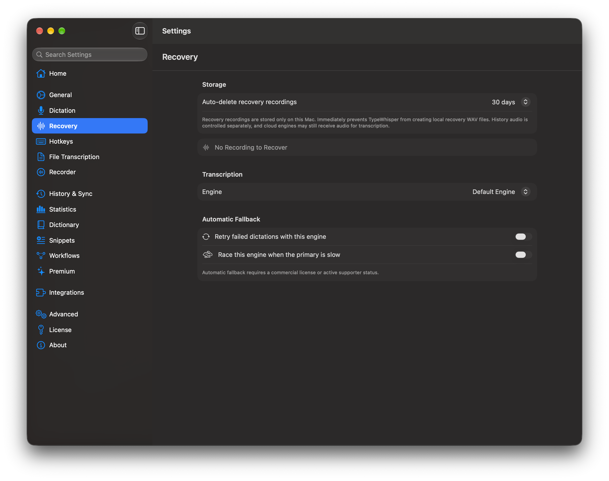
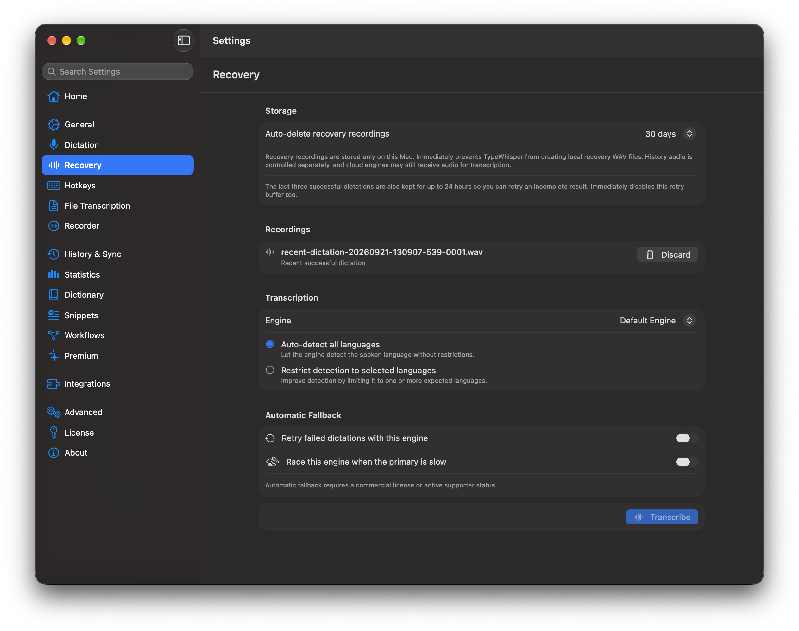
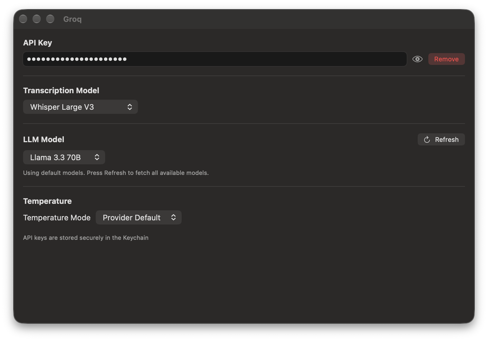
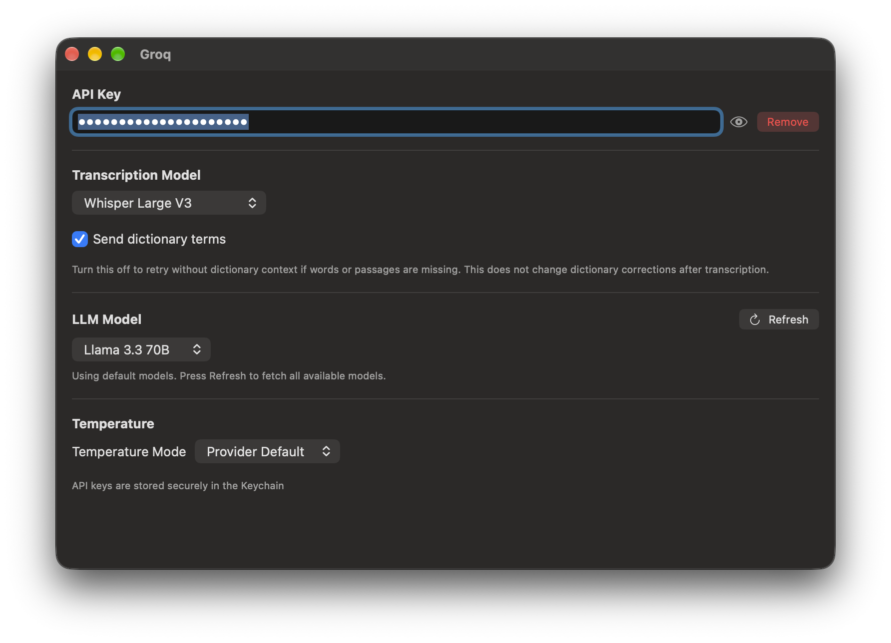

# Issue #1352: before and after

Real macOS window captures in English, dark appearance, on 2026-09-21.
Before: unmodified `5c5e49f078a177f56d98cdfacddb1cf104cb5708` and its Groq plugin.
After: the implementation in this PR and its rebuilt Groq plugin.

Both builds use the existing `--store-screenshots` fixture mode, separate temporary
app-support directories and separate application identifiers. The displayed API
key is the built-in dummy fixture; no personal history, credentials or device names
are used. Text/EXIF metadata was removed without changing PNG pixel data.

| View | Before | After |
| --- | --- | --- |
| Recovery |  |  |
| Groq settings |  |  |

Recovery uses the same 1,150-point window width. The before capture shows the empty
state that previously remained after successful dictation. The after capture uses
40 seconds of synthetic PCM passed through the actual `DictationRecoveryAudioStore`
(`startNewRecording`, `append`, `preserveActiveRecordingResult(successful: true)`).
It shows the retained recording and its new label. This is a UI fixture, not a
claim that the screenshot itself proves live-provider transcription quality.
No transcription engine is configured in the Recovery fixture, so Transcribe is
disabled. The separate integration tests cover the successful dictation path with
History audio disabled and preservation of all 640,000 samples.

Groq uses the same 780-point width and 500-point requested content height. Window
shadows differ with focus; neither image has been composited or retouched.

Fixture launch arguments:

```sh
--store-screenshots --screenshot-state recovery \
  --screenshot-app-support "$FIXTURE_SUPPORT" \
  -AppleLanguages '(en)' -preferredAppLanguage en

--store-screenshots --screenshot-plugin-id com.typewhisper.groq \
  --screenshot-app-support "$FIXTURE_SUPPORT" \
  --screenshot-window-width 780 --screenshot-window-height 500 \
  -AppleLanguages '(en)' -preferredAppLanguage en
```

`FIXTURE_SUPPORT` must be a directory below macOS's per-user temporary directory.
The matching Groq bundle is installed into its `Plugins` subdirectory.
