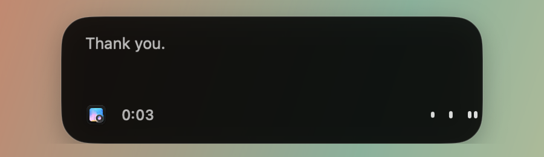
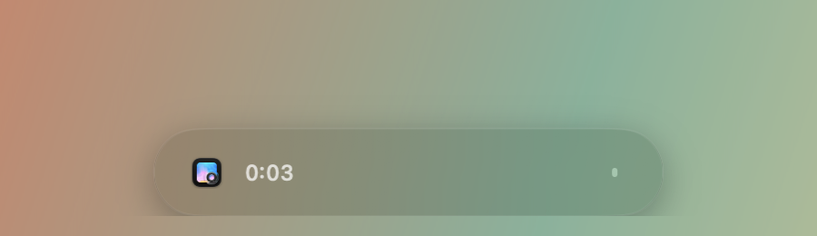
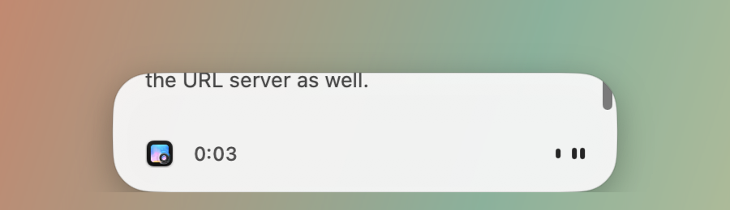

# PR #1381: indicator themes

Real overlay captures of the dev app built from this branch on 2026-09-25, macOS 26, dark system appearance, in front of a synthetic gradient image opened in Preview. The app icon in the pill is Preview's. No personal data is shown; the recording captures came from `POST /v1/dictation/start` on the local API with the app killed before insertion, so the transcript text is Whisper output on ambient noise.

| Theme | Idle | Recording |
| --- | --- | --- |
| Classic |  |  |
| Glass |  |  |
| Light |  |  |

Capture: `screencapture -x -R 356,520,800,462`, then cropped to the pill region with ffmpeg. Pixels were not retouched.
