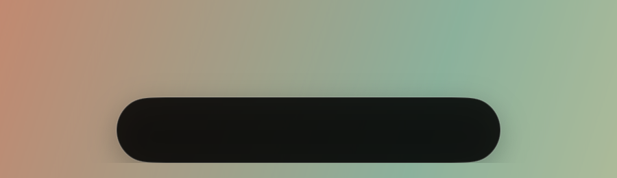
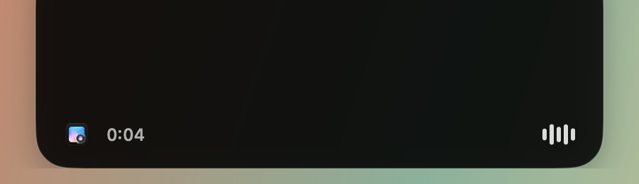
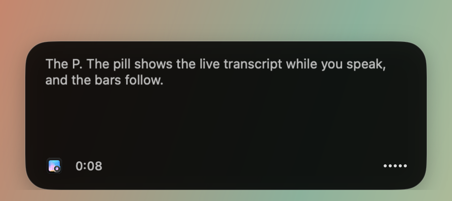
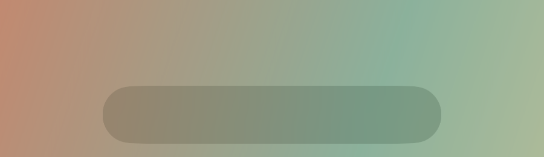
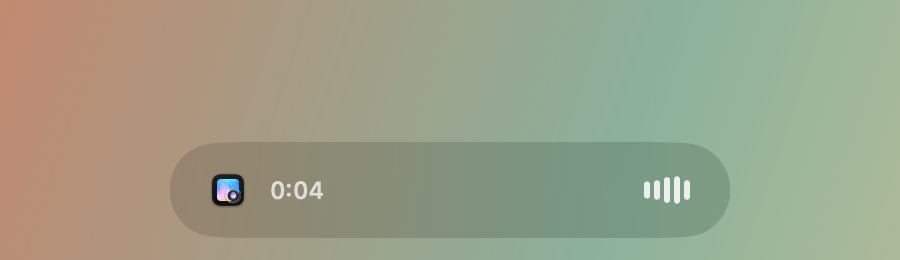
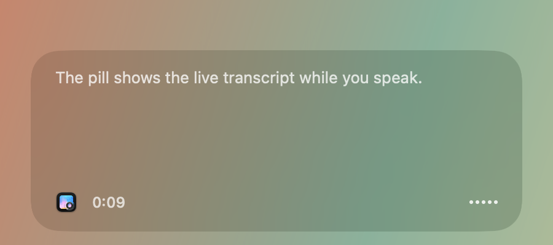
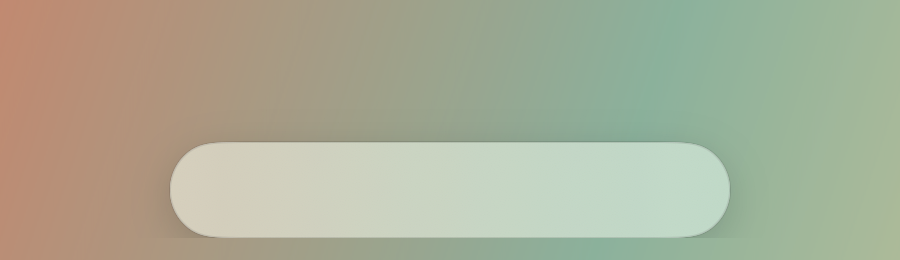
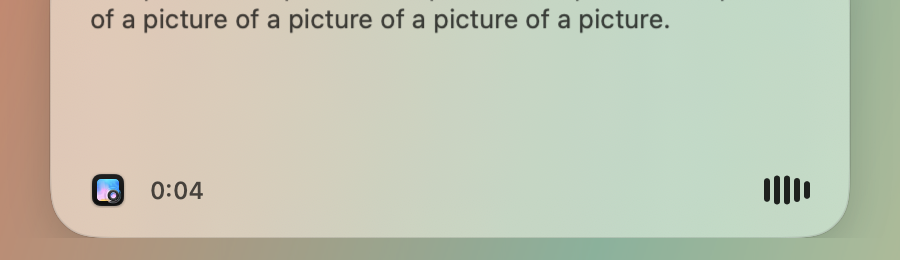
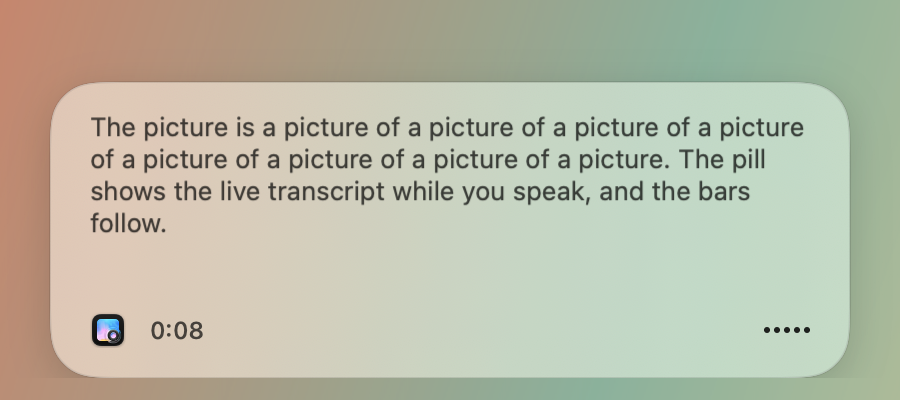

# PR #1381: indicator themes and waveform

Real overlay captures of the dev app built from this branch on 2026-09-25, macOS 26, dark system appearance, in front of a synthetic gradient image opened in Preview. The app icon in the pill is Preview's. Audio came from `say` routed through the BlackHole loopback device, so the transcript text is the spoken test sentence, and the app was killed before anything was inserted. Whisper adds a hallucinated lead-in on the first partial in some runs.

| Theme | Idle | Speaking | Transcript |
| --- | --- | --- | --- |
| Classic |  |  |  |
| Glass |  |  |  |
| Light |  |  |  |

Capture: `screencapture -x -R 356,520,800,462`, then cropped to the pill region with ffmpeg. Pixels were not retouched.
