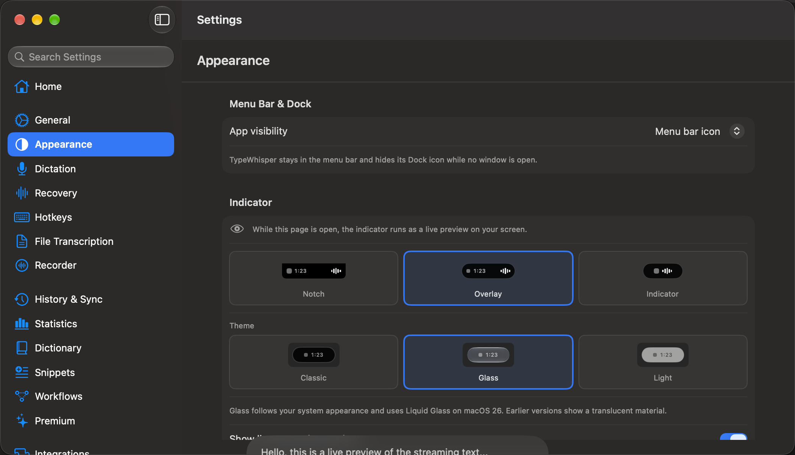
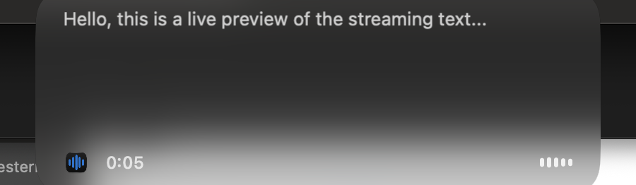
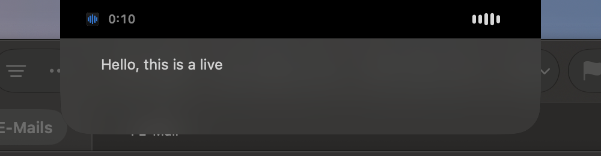
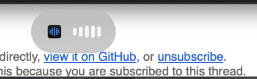

# PR #1384: Appearance page with live indicator preview

Captures of the dev app built from this branch on 2026-09-25, macOS 26, dark system appearance. The Settings window was opened through the app's reopen path and the Appearance sidebar entry was clicked; no dictation was running, so everything on screen comes from the live preview session. The app icon in the pill is TypeWhisper's own. Backgrounds show whatever was behind the indicator at the time, cropped to the indicator.

| Appearance page | Overlay, Glass | Notch, Glass | Indicator, Glass |
| --- | --- | --- | --- |
|  |  |  |  |

Capture: window bounds from System Events for the page, `screencapture -x -R` regions for the indicator, then cropped with ffmpeg. Pixels were not retouched.
